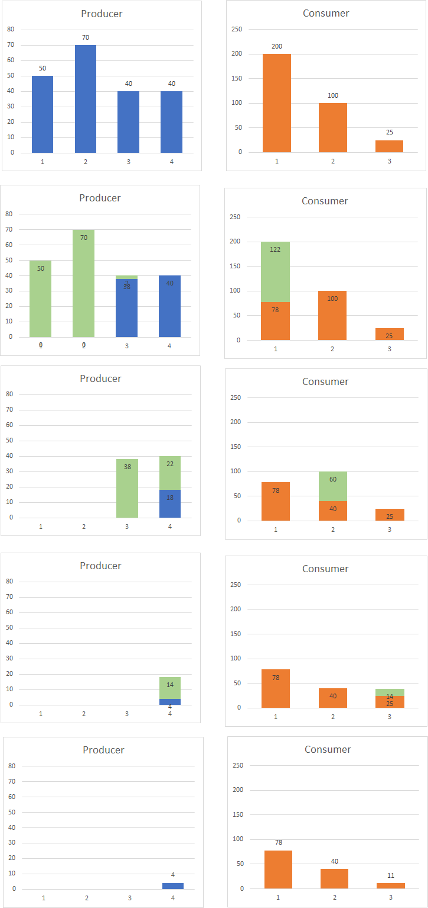

# Utility Contract(s)

Track energy production and consumption and distribute them fairly.

## Overview

Our contract is structured in the following way:

- `Mortal.sol` inherites from `openzeppelin-solidity/contracts/ownership/Ownable.sol` defining ownership of the utility contract and has the authority to permanently deactivate it.
- `UtilityBase.sol` implements the core logic of our utility `./interfaces/IUtilityBase.sol`.
- `Utility.sol` inherits from `./UtilityBase.sol` and implements settlement (netting) `./interfaces/IUtility.sol` to fairly distribute renewable energy.

## Test utility contracts

You can run the tests with `yarn test-contracts` without running a local Ethereum client.

## Common functions

The following is an outline of how we expect the flow of function calls looks like:

1. Households periodically provide information about energy production and consumption by using `updateRenewableEnergy` (and/or `updateNonRenewableEnergy`).
2. Authority nodes periodically invoke regulation of the produce and consume imbalance such that most households are _happy_ (`settle`).
3. Energy transferred by the settlement is tracked and stored in `deeds`.
4. (WIP) Compensate negative amount of `renewableEnergy` by a simulated official utility organization calling (`updateNonRenewableEnergy`).

It is assumed that the utility contract is owned by a trusted party (perhaps a multisig wallet of trusted people). The owner has the authority to add new households using `addHousehold`.

## Settlement

The settlement function transfers renewable energy between households such that the average of the
absolute values of all household's renewable energy is close to zero.

### Outline

The basic approach of our algorithm is the following:

- if households require more energy than it can be fulfilled, then share all produced energy such all producing households' energy is 0.
- if households produce more than currently required, then fulfill all requests such that all
  consuming households' energy is 0.

Basically, we ensure that one household group (either the producing ones or the consuming ones) is 0 (or close to it). What about the _other group_, i.e. the group's energy that is not 0?
Depending on which household group, they either _claim_ or _give_ energy at a proportional amount of the
total consumed/produced energy. For example, consider the following household energy state:

`hh1 = 200, hh2 = 100, hh3 = -100, hh4 = -100`

Here, the total amount produced would be `300` and consumed `|-200| = 200`. It has been more produced than consumed, more to give than asked. So we can guarantee to fulfill everyone's request. Additionally, because we want that all producing household's get a appropriate cut from the cake, every producing household shares their percentage of contribution to the system applied to the total amount of energy needed. In this case, `hh1` contributed `66%` to the system so they get share `66% of 200 = 132` amount of energy spread to all households in a FIFS manner (time of household added), i.e. `transfer(hh1, hh3, 100)` and additionally `transfer(hh1, hh4, 32)`. Same applies to `hh2`. In the end we have

`hh1 = 68, hh2 = 34, hh3 = 0, hh4 = -2`

Due to rounding errors, `hh2` is not quiet `0` because we use integer numbers.

In the opposite case, where more is demanded than supplied, we do the almost the same but with a
negative amount in `transfer()`, which can be interpreted as claiming energy from another household instead of giving.

Below is another example, but visualized (read from up to down, each row is one step).

