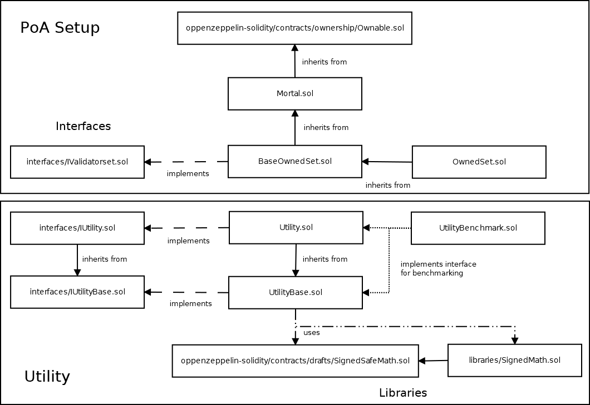
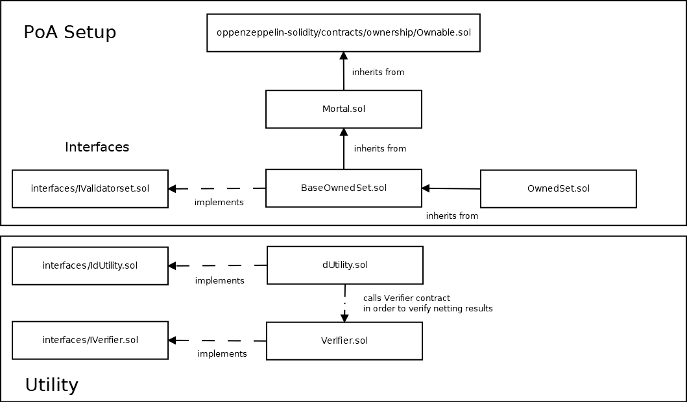
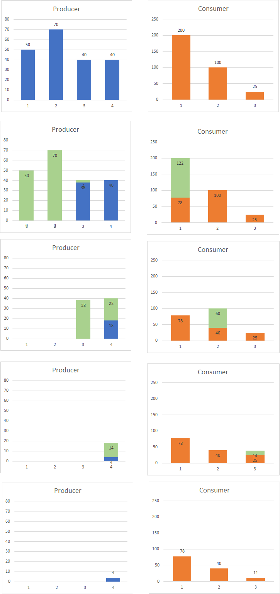

# Utility Contract(s)

In the first milestone, renewable energy production, consumption as well as _consistent_ and _fair_ distribution are tracked and calculated on-chain. During milestone one `UtilityBase.sol`, `Utility.sol`, corresponding interfaces and libraries were implemented.
The second milestone aims for an approach where privacy of households' energy flow is preserved. Energy production, consumption and distribution cannot be tracked and calculated on-chain. Nevertheless, energy tracking and netting need to be verified on-chain such that the consistency and fairness of the netting results are traceable. During milestone two `dUtility.sol`, corresponding interfaces and libraries were implemented.

Execute `yarn install` followed by `yarn test-contracts` without running a local Ethereum client in order to run tests for all utility contracts.

## Overview

Our contracts of **milestone one** are structured in the following way:

- `Mortal.sol` inherites from `openzeppelin-solidity/contracts/ownership/Ownable.sol` defining ownership of the utility contract and has the authority to permanently deactivate it.
- `UtilityBase.sol` implements the core logic of our utility `./interfaces/IUtilityBase.sol`.
- `Utility.sol` inherits from `./UtilityBase.sol` and implements settlement (netting) `./interfaces/IUtility.sol` to fairly distribute renewable energy.

Our contracts of **milestone two** are structured in the following way:

- `dUtility.sol` implements the logic to validate energy tracking on-chain `./interfaces/IUtilityBase.sol` and depends on ZoKrates implementation generated contract `Verifier.sol` for verification of consistent and fair netting results.

## Settlement (netting)

The settlement algorithm (implemented in `Utility.sol` of milestone one or in `Utility.js` of milestone two) transfers renewable energy between households such that the average of the absolute values of all households' renewable energy is equal to, or close to zero.

### Outline

The basic approach of our settlement algorithm is the following:

- In the network, more energy is required than it can be fulfilled actually. All contributed (means produced and unspent) energy is distributed such that all contributing households' energy is equal to, or close to zero. All recipients claim a proportion from the total produced and unspent energy, or the energy pool, based on their required energy relative to the total required energy.
- More energy is contributed than currently required. Symmetrically, all required energy is fulfilled such that all requiring households' energy is equal to, or close to zero. Accordingly, all contributing households distribute their produced and unspent energy, or the energy pool, that is equal to the ratio of the total contributed energy scaled to the total required energy amount.

Basically, we ensure that one household group (either the contributing ones or the requiring ones) is zero (or close to it). What about the _other group_, i.e. the group's energy that is not 0? Depending on which household group, they either _claim_ or _give_ energy at a proportional amount of the total required/contributed energy.

### Examples

Below examples refer to milestone one implementation in `Utility.sol` of function `settle`.
Consider the following household energy state:

`hh1 = 200, hh2 = 100, hh3 = -100, hh4 = -100`.

Here, the total amount produced would be `300` and consumed `|-200| = 200`. It has been more produced than consumed, more to give than asked. So we can guarantee to fulfill everyone's request. Additionally, because we want that all producing household's get a appropriate cut from the cake, every producing household shares their percentage of contribution to the system applied to the total amount of energy needed. In this case, `hh1` contributed `66%` to the system so they get share `66% of 200 = 132` amount of energy spread to all households in a FIFS manner (time of household added), i.e. `transfer(hh1, hh3, 100)` and additionally `transfer(hh1, hh4, 32)`. Same applies to `hh2`. In the end we have

`hh1 = 68, hh2 = 34, hh3 = 0, hh4 = -2`.

Due to rounding errors, `hh2` is not quiet `0` because we use integer numbers.

In the opposite case, where more is demanded than supplied, we do the almost the same but with a
negative amount in `transfer()`, which can be interpreted as claiming energy from another household instead of giving.

Below is another example, but visualized (read from up to down, each row is one step).

